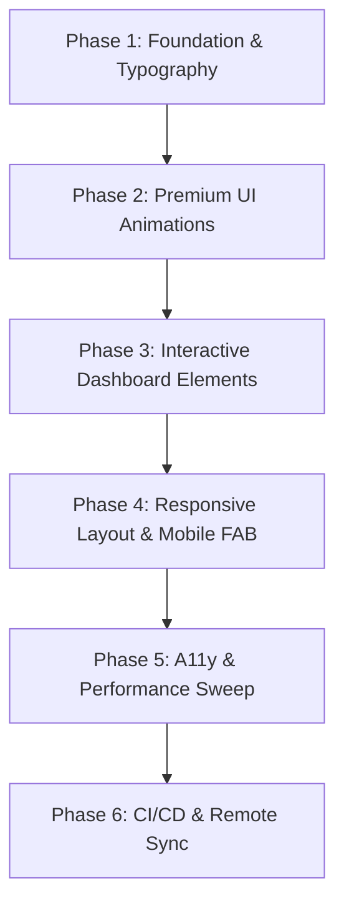

# Kalori Redesign & Modernization Plan

This document outlines the structured roadmap for the professional redesign and production-ready modernization of the Kalori calorie and nutrition tracking application. It establishes "The Ledger" editorial aesthetic, enhances UI animations, coordinates responsiveness, tightens accessibility compliance, and ensures CI/CD pipeline integrity.

---

## 1. Aesthetic Guidelines: "The Ledger"

All visual components must align strictly with the editorial, broadsheet-style "The Ledger" theme. Ad-hoc styling is forbidden; all styles must draw directly from the design tokens defined in `app/globals.css`.

### Visual Rules

- **Theme Limits**: Dark-mode only. No user-facing toggle to light mode.
- **Palette**:
  - **Page Background (`bg-0`)**: `#0E0A08` (rich warm black/candlelit-neutral)
  - **Card/Field Background (`bg-1`)**: `#15100D` (warm charcoal)
  - **Inset/Meter Background (`bg-2`)**: `#1E1815` (deep coffee)
  - **Dividers/Hairlines (`rule`)**: `#3f3731` (1px solid default boundary)
  - **Strong Dividers (`rule-strong`)**: `#504742` (1px solid emphasized boundary)
  - **Primary Text (`text-primary`)**: `#F4EBDC` (ivory)
  - **Secondary Text (`text-secondary`)**: `#C9BDA8` (sand)
  - **Brand/Accent Color (`accent`)**: `#8A2A1F` (signature oxblood)
- **Zero border-radius**: All cards, inputs, buttons, search bars, and dialogs must use `rounded-none` (`border-radius: 0`).
  - _Permitted Exceptions_: Chronometer Ring (SVG circle), Water tracker bullets, status indicator dots, avatars, and loading spinners.
- **No Shadows/Glassmorphism**: Avoid `box-shadow`, `backdrop-filter`, and glowing gradients. Focus on crisp borders, typographic scale, and solid background shapes to establish depth and structure.

### Typography

- **Warm Serif (`Newsreader`)**: Reserved for brand headers, main titles, calorie counters, and typographic pull-quotes (e.g., the Miflin-St Jeor equation panel).
- **Modern Sans-serif (`Inter`)**: Used for functional elements, buttons, inputs, navigation items, and labels.
- **Editorial Monospace (`JetBrains Mono`)**: Used for timestamps, section markers, metadata, and numerical coordinates.
- **Numbers**: Use the `.num` CSS class (utilizing `font-variant-numeric: tabular-nums;`) on all tickers, logs, and dates to prevent layout shifts.

---

## 2. Accessibility (A11y) Constraints

We target WCAG 2.1 Level AA compliance.

- **Focus Rings**: Standardize on a high-visibility `outline: 2px solid #F4EBDC` with a `2px` offset (`focus-visible:outline-2 focus-visible:outline-ivory focus-visible:outline-offset-2`).
- **Text Contrast**: Ensure all color combinations meet contrast thresholds. Under The Ledger theme, oxblood text on warm black is below the AA ratio. Accent text must be presented as ivory on an oxblood background, or outlined in oxblood, or use Ember tones where appropriate.
- **Keyboard Navigation**: Screen reader focus must be locked inside modals and dialogs using standard focus traps.
- **Screen Reader Live Regions**: Use a unified live region announcer for high-frequency dynamic states (e.g., "Logged 250ml water").
- **Reduced Motion**: Respect system motion preferences using Tailwind's `motion-safe:` and `motion-reduce:` modifiers. All Framer Motion components must integrate the `useReducedMotion` hook.

---

## 3. Implementation Phases

### Phase 1: Foundation & Typography Refinement

- **Objective**: Standardize CSS custom properties and apply strict typography scopes.
- **Tasks**:
  1. Review `app/globals.css` and verify all custom Ledger tokens are mapped correctly to Tailwind variables.
  2. Implement proper `next/font` imports for `Newsreader`, `Inter`, and `JetBrains Mono` at the root layout.
  3. Replace all inline fonts and font family declarations with the standardized typography rules.
  4. Perform a layout sweep to ensure all text elements use their corresponding family tokens.

### Phase 2: Premium UI Animations

- **Objective**: Add micro-interactions and transitions to create a tactile, premium editorial feel.
- **Tasks**:
  1. Define a centralized animation config: standardise on a custom ease-out cubic-bezier `[0.2, 0.8, 0.2, 1]` ("editorial ease").
  2. Implement spring-driven page transitions and slide-in panels using `framer-motion`.
  3. Add micro-animations on interactive states: link hovers, active button presses, and input focus highlights.
  4. Ensure list item additions/deletions animate smoothly via `<AnimatePresence>`.
  5. Add fallback layouts for users with `prefers-reduced-motion` enabled.

### Phase 3: Interactive Dashboard Elements

- **Objective**: Modernize visual indicators and data grids.
- **Tasks**:
  1. **Chronometer Ring**: Upgrade the SVG ring to animate smoothly on load using Framer Motion SVG path animations. Add dual outer/inner arcs to visually represent target vs active calories.
  2. **Macro progress**: Refactor the horizontal macro progress bars to slide to their percentages on mount.
  3. **Micronutrient Heatmap**: Render custom cells that use typographic hatch patterns instead of color ramps for high values, and display detailed RDA percentages on hover.
  4. **Meals Bulletin**: Refine the 5-column grid layout to display food item details using custom monospaced timestamps.

### Phase 4: Responsive Layout & Mobile FAB

- **Objective**: Correct responsive navigation shells and optimize mobile inputs.
- **Tasks**:
  1. Audit conditional navigation layout shells to ensure Sidebar (desktop), Collapsible Icon rail (tablet), and Bottom Tab-bar (mobile) render using pure CSS media queries, preventing hydration flicker.
  2. Format the mobile Bottom Bar to hold the dual-FAB buttons (`Log Food` and `Log Water`) side by side, ensuring target size requirements (at least 44x44px).
  3. Restructure layout column wrappers to include `min-width: 0` to prevent horizontal overflows.

### Phase 5: Accessibility & Performance Sweep

- **Objective**: Polish code splitting, focus management, and screen-reader announcements.
- **Tasks**:
  1. Integrate custom keyboard trapping behavior in all dialog overlay views.
  2. Implement global skip-to-main links on all core routes.
  3. Wire dynamic updates (e.g. water additions, deletion confirmations) to `aria-live` screen announcer components.
  4. Code-split heavy components (such as charts and complex dialog forms) using React `Suspense` and `dynamic` imports to improve Lighthouse scores.

### Phase 6: CI/CD & Deployment Alignment

- **Objective**: Secure deployment pipelines and fix configuration discrepancies.
- **Tasks**:
  1. Update `scripts/vercel-ignore-red-ci.sh` to target the active user repository `tomtom1980/kalori-tamas-dev` instead of the hardcoded `tomtom1980/kalori` to ensure commit check status polling works correctly in Vercel.
  2. Validate that environment variables like `NEXT_PUBLIC_KALORI_ENV` are appropriately configured in the development, preview, and production Vercel project scopes.
  3. Confirm that build steps enforce rules such as `no-gemini-leak` to guarantee the integrity of secrets.

---

## 4. Verification & Testing Plan

Each implementation phase must be validated using TDD principles and verified across automated layers before merging.

### 1. Unit & Component Verification (Vitest)

- Run the unit test suite (`pnpm test`) to verify business logic and visual token compliance.
- Add snapshot and interactive tests for all newly styled components.
- Ensure code changes maintain or exceed existing coverage thresholds.

### 2. E2E & Accessibility Scans (Playwright)

- Execute Playwright tests (`pnpm test:e2e`) across target devices (Mobile, Tablet, Desktop viewports).
- Conduct automated accessibility scans via `@axe-core/playwright` on all major dashboard views to guarantee zero critical/serious violations.
- Assert that the skip-to-main links are keyboard focusable and functional.

### 3. Deployment & CI Checks

- Confirm that preview branch builds compile successfully on Vercel.
- Verify that Sentry error capturing handles environment mapping correctly based on scope tags.
- Ensure the build pipeline remains green across all custom ESLint security rules.
